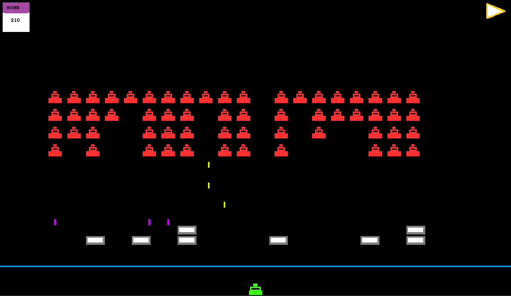

# What's *Mock Invaders*?

**Mock Invaders** is a minimal C++ implementation of *Space Invaders*, built to explore the fundamentals of the **Entity-Component-System (ECS)** architecture.  

It includes:  
- Player movement and firing  
- Randomized enemy firing  
- Pausing  
- Scoring  
- Hit detection  

---

# What's *ECS*?

Unlike the tree-like structure of Object-Oriented Programming (OOP), **ECS** has only three layers:  

- **Systems** – handle game logic  
- **Components** – represent game data  
- **Entities** – collections of components tied to in-game objects  

> *Entities are simply tags; they contain no data or logic themselves.*  

At its core, ECS emphasizes **composition over inheritance**. Instead of a complex hierarchy of classes and interfaces, entities are associated with components (similar to pointers referencing data).  

**Example:**  
Rather than creating a `Player` class that extends `Character` and implements `Hittable`, ECS allows you to represent these traits as booleans linked to *entity* 0,1,2... etc.  

The exact method of association is left to the developer.  

---

# How I Implemented ECS

**Entities** (`entity_t`): Defined as `size_t`  

**Components**: Implemented as `structs`  

**Registry**: A `struct` mapping entities to components, storing additional data (e.g., strings). Binary flags (e.g., *isPlayer*, *isHittable*) are represented as vectors of `size_t`.  

### Systems
- **Active Systems** – require player input  
- **Passive Systems** – run independently of player input  

### Managers
Classes responsible for resource creation and management, such as:  
- `EntityManager`  
- `SpriteManager`  
- `TextureManager`  

### Services
- **GameService** – provides the API for systems, delegating tasks to managers  
- **SystemService** – encapsulates all systems into a single object for easier use  

### Other 

An **Initializer** sets up all entities at the start of the game. Additionally, there are a set of utility options used to simplify collision detection. 

---

# Images

